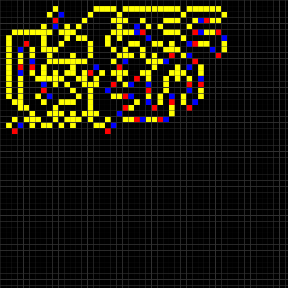

# Brian Silverman's Wireworld

[https://en.wikipedia.org/wiki/Wireworld]()

## Usage

- `SPACE` toggles pause.

When the simulation is paused, there are other commands available:

- `s` - the simulation is advanced one step

- `left mouse click` - inserts the current element on the grid
  (current element is written in the upper-left corner of the window

- `c` - sets current element to conductor

- `h` - sets current element to electron-head

- `t` - sets current element to electron-tail

- `e` - sets current element to empty

## Loading initial setup

`main` function can be changed to load an initial setup.
This has to be provided as a text file, using the following encoding:

-  `.`: empty
-  `C`: conductor
-  `H`: electron-head
-  `T`: election-tail

See  for an example.
